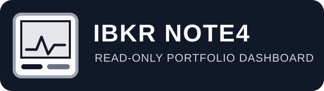
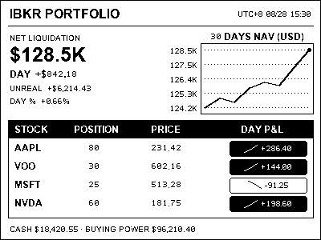
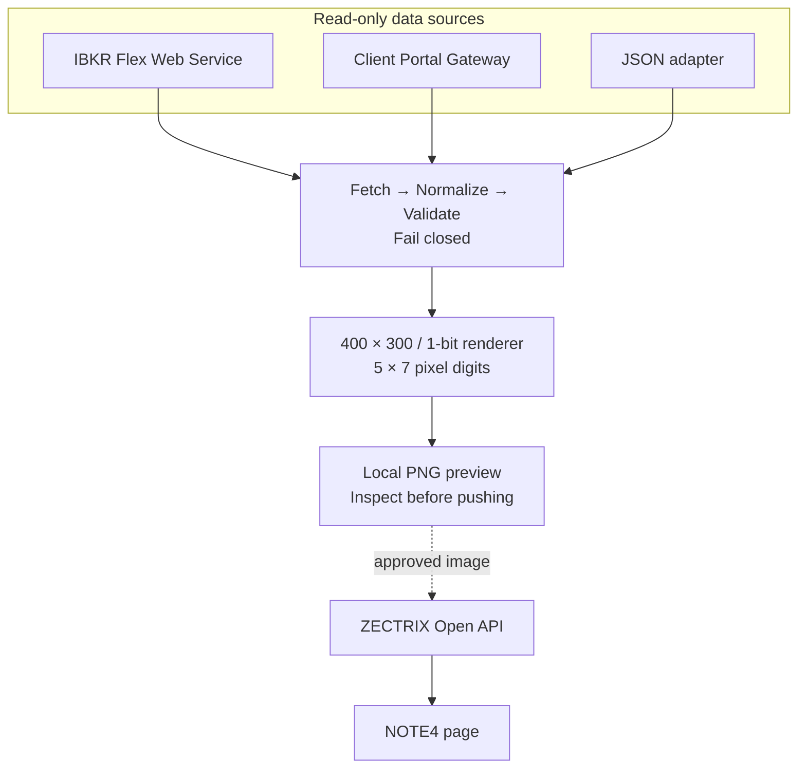

# IBKR NOTE4 Dashboard

<p align="center">
  
</p>

<p align="center">
  <strong>English</strong> · <a href="README.zh-CN.md">简体中文</a>
</p>

A standalone, self-hosted, read-only portfolio dashboard for Interactive Brokers. It fetches an account snapshot, renders a deterministic **400 × 300 monochrome PNG**, and can send the reviewed image to a ZECTRIX NOTE4.

It does not depend on ChatGPT, Codex, an LLM, or a hosted application backend. It never places, modifies, or cancels orders.

> **Status: Alpha.** Treat the display as informational and verify important values against IBKR.

## Preview

This image is generated from the bundled fictional fixture. It contains no real account, position, or device data. Small numbers use 5 × 7 pixel glyphs for clearer 1-bit e-paper rendering.

<p align="center">
  
</p>

## How it works



The runtime:

- reads from Flex, Client Portal, or an explicitly configured JSON source;
- stops on missing or ambiguous data instead of turning unavailable values into zero;
- produces an exact 400 × 300, 1-bit image with up to 30 daily NAV points;
- stores only a display-data SHA-256 and timestamp after a successful push, so unchanged images can be skipped;
- may keep local NAV history, but never stores raw Flex responses, tokens, or account IDs in state files.

## Choose a deployment path

| Your situation | Recommended path | Configuration |
| :---: | :---: | :---: |
| Preview the project with no credentials | Local Python | [5-minute local preview](#local-python) |
| VPS or NAS; simplest long-running setup | Flex + Docker Compose | [Docker Compose setup](#docker-compose) |
| Linux host with native service management | Flex + systemd | [systemd setup](#systemd) |
| No server available | Flex + GitHub Actions | [GitHub Actions setup](#github-actions) |
| Near-real-time interactive use | Client Portal Gateway | [Client Portal setup](#client-portal) |

For unattended use, start with **IBKR Flex + Docker Compose**. Every path should still follow the same safety order: local preview → live no-push render → image review → first push.

<a id="local-python"></a>
## 5-minute local preview

Requirements: Python 3.11 or newer.

```bash
git clone https://github.com/JessYi228/ibkr-note4-dashboard.git
cd ibkr-note4-dashboard

python3 -m venv .venv
. .venv/bin/activate
python -m pip install -e .

ibkr-note4 preview --output output/preview.png
```

`preview` uses only the bundled fictional fixture. It does not contact IBKR or ZECTRIX. Open `output/preview.png` and check its layout before configuring live data.

If GitHub asks for authentication when cloning this repository, sign in first. If the source is already downloaded, start at `cd ibkr-note4-dashboard`.

<a id="live-setup"></a>
## First live setup

### 1. Create a private configuration file

```bash
ibkr-note4 init
```

This creates `.env` with mode `0600`. If the file already exists, the command stops rather than overwriting it. Use `ibkr-note4 init --force` only when you intentionally want to replace the file.

### 2. Choose an IBKR data source

Set `IBKR_SOURCE` in `.env`:

| Value | Best for | Required configuration |
| :---: | :---: | :---: |
| `flex` | VPS, NAS, containers, schedulers | `IBKR_FLEX_QUERY_ID`, `IBKR_FLEX_TOKEN` |
| `client_portal` | Interactive, near-real-time use | Running and browser-authenticated Client Portal Gateway |
| `json` | Testing or a custom read-only adapter | Explicit local file or HTTPS `IBKR_JSON_SOURCE` |

`preview` is the only command that defaults to sample data. A live `run` never falls back to the bundled fixture.

<a id="credentials"></a>
### 3. Where API credentials and IDs come from

| Setting | Where to obtain it | Secret? |
| :---: | :--- | :---: |
| `IBKR_FLEX_QUERY_ID` | Create an Activity Flex Query in [IBKR Client Portal → Performance & Reports → Flex Queries](https://www.ibkrguides.com/clientportal/performanceandstatements/flex.htm). The saved query exposes its Query ID. | No, but keep private |
| `IBKR_FLEX_DAILY_QUERY_ID` | Create a second Activity Flex Query in the same place with period **Last Business Day**. This setting is optional. | No, but keep private |
| `IBKR_FLEX_TOKEN` | Open [Flex Web Service Configuration](https://www.ibkrguides.com/clientportal/performanceandstatements/flex3.htm), enable the service, then select **Generate New Token**. A new token invalidates the old token. | **Yes** |
| Client Portal Gateway | Download it from the [official IBKR installation page](https://ibkrcampus.com/docs/web-api/authentication/cpgw/installation-authentication), run it locally, then sign in at `https://localhost:5000`. | Uses your interactive IBKR login; do not store it here |
| `IBKR_CP_ACCOUNT_ID` | Optional. The application uses the first account returned by `/portfolio/accounts` when empty. Set it only to select among multiple accounts. | Sensitive identifier |
| `ZECTRIX_API_KEY` | Sign in to [ZECTRIX Cloud API Docs](https://cloud.zectrix.com/home/api-docs), open **Open API**, and select **Create API Key**. The [ZECTRIX API reference](https://wiki.zectrix.com/en/software/api-docs) documents authentication and endpoints. | **Yes** |
| `ZECTRIX_DEVICE_ID` | Leave empty when exactly one device is bound, or run `ibkr-note4 devices` to list masked device metadata. | Sensitive identifier |
| `HEALTHCHECK_URL` | Optional private ping URL from a Healthchecks-compatible service. | **Yes** |

Never paste these values into an issue, commit, screenshot, or chat. The URLs above are documentation and login entry points; this project does not retrieve credentials for you.

<a id="flex"></a>
### 4. Recommended Flex queries

Create an XML Activity Flex Query with period **Last 30 Calendar Days**. Include at least:

- **Net Asset Value (NAV) Summary in Base:** Report Date, Cash, Total.
- **Open Positions:** Symbol, Position, Mark Price, Position Value, FIFO PnL Unrealized, FIFO PnL Realized, Currency.
- **Change in NAV:** From Date, To Date, Mark-to-Market, Ending Value.

Then set:

```text
IBKR_SOURCE=flex
IBKR_FLEX_QUERY_ID=your-main-query-id
IBKR_FLEX_TOKEN=your-flex-token
```

For true account and per-position `DAY P&L`, create an optional second XML query with period **Last Business Day**, add **Mark-to-Market Performance Summary in Base**, and set:

```text
IBKR_FLEX_DAILY_QUERY_ID=your-daily-query-id
```

Without the daily query, `DAY P&L` is rendered as `N/A`; cumulative FIFO unrealized P&L is never mislabeled as daily P&L. Activity Flex also does not provide buying power, so that field is normally `N/A` in Flex mode.

See [docs/flex-query.md](docs/flex-query.md) and the official [Activity Flex Query field reference](https://www.ibkrguides.com/reportingreference/reportguide/activity%20flex%20query%20reference.htm).

<a id="client-portal"></a>
### 5. Client Portal Gateway

Use this path only when browser authentication and an interactive session are acceptable.

1. Follow the [official installation and authentication guide](https://ibkrcampus.com/docs/web-api/authentication/cpgw/installation-authentication).
2. Start the gateway and log in at `https://localhost:5000`.
3. Configure `.env`:

```text
IBKR_SOURCE=client_portal
IBKR_CP_BASE_URL=https://localhost:5000/v1/api
IBKR_CP_ACCOUNT_ID=
IBKR_CP_VERIFY_TLS=false
```

`IBKR_CP_VERIFY_TLS=false` is intended only for the gateway's local self-signed certificate. Do not expose the gateway directly to the public internet.

<a id="zectrix"></a>
### 6. ZECTRIX delivery

Create the API key using the [official ZECTRIX Cloud instructions](https://cloud.zectrix.com/home/api-docs), then set:

```text
ZECTRIX_API_BASE_URL=https://cloud.zectrix.com
ZECTRIX_API_KEY=your-api-key
ZECTRIX_DEVICE_ID=
ZECTRIX_PAGE_ID=1
```

If exactly one device is bound, `ZECTRIX_DEVICE_ID` may remain empty. Validate the key and list masked devices with:

```bash
ibkr-note4 devices
```

On macOS, the application can also read these Keychain service names:

```text
ibkr-zectrix-dashboard/ibkr-flex-token
ibkr-zectrix-dashboard/zectrix-api-key
```

See [docs/zectrix-api.md](docs/zectrix-api.md) for the exact image-delivery contract.

### 7. Validate in the safe order

```bash
# Static configuration check; does not print portfolio values.
ibkr-note4 doctor

# Fetch once and report field availability, without values or symbols.
ibkr-note4 doctor --probe

# Fetch and render real data, but never contact ZECTRIX.
ibkr-note4 run --no-push

# Inspect output/ibkr-dashboard.png, then verify masked device metadata.
ibkr-note4 devices

# Only after reviewing the real preview, perform the first push.
ibkr-note4 run
```

Successful pushes are deduplicated. Use `ibkr-note4 run --force` only when an unchanged image truly needs to be resent.

<a id="docker-compose"></a>
## Docker Compose: recommended for a VPS or NAS

Complete `.env` first, then run:

```bash
mkdir -p output state

# Linux only: make bind mounts writable by container uid 10001.
sudo chown 10001:10001 output state

docker compose build
docker compose run --rm dashboard ibkr-note4 doctor
docker compose run --rm dashboard ibkr-note4 doctor --probe
docker compose run --rm dashboard ibkr-note4 run --no-push
```

Review `output/ibkr-dashboard.png`, then perform the first push:

```bash
docker compose run --rm dashboard
```

The container runs read-only, drops Linux capabilities, and uses a non-root user. `output/` and `state/` are its only persistent writable paths. Docker Desktop on macOS normally does not need the `chown` step.

Compose performs one refresh per invocation. Use the host scheduler, systemd timer, or another orchestrator for recurring runs.

<a id="systemd"></a>
## systemd: native Linux scheduling

Templates under `deploy/systemd/` assume:

- installation at `/opt/ibkr-note4-dashboard`;
- a dedicated `ibkr-note4` user and group;
- a mode-`0600` `/etc/ibkr-note4-dashboard.env`;
- service-owned `output/` and `state/` directories.

After installing the project and reviewing those assumptions:

```bash
sudo cp deploy/systemd/ibkr-note4-dashboard.service /etc/systemd/system/
sudo cp deploy/systemd/ibkr-note4-dashboard.timer /etc/systemd/system/
sudo systemctl daemon-reload

# Validate one run before enabling the timer.
sudo systemctl start ibkr-note4-dashboard.service
sudo journalctl -u ibkr-note4-dashboard.service --no-pager

# Enable only after the preview and logs are correct.
sudo systemctl enable --now ibkr-note4-dashboard.timer
systemctl list-timers ibkr-note4-dashboard.timer
```

The supplied timer runs on weekdays at `10:17 UTC` with up to five minutes of randomized delay. Flex data is generally T-1, so hourly polling is not the default.

<a id="github-actions"></a>
## GitHub Actions: no-server option

Keep live refresh automation in a **separate private deployment repository**. This public source repository intentionally runs credential-free CI only. An inert starting template is available at [`deploy/github-actions/refresh.yml.example`](deploy/github-actions/refresh.yml.example); GitHub does not execute files outside `.github/workflows/`.

1. Create an independent private repository rather than a fork; public forks cannot be private.
2. Copy the example to `.github/workflows/refresh.yml` in that private repository.
3. Add the required Flex and ZECTRIX values as private repository Actions secrets.
4. Run the workflow manually with `no_push=true`.
5. Confirm that the log reports success without values or identifiers.
6. Run once with `no_push=false` for the first delivery.
7. Only then enable `schedule` in the private deployment repository.

The template checks out a pinned public release, does not upload portfolio images, and does not use Actions cache as a database; the 30-day history comes from Flex. Scheduled Actions may be delayed, so a VPS or NAS is usually more dependable.

## Configuration reference

| Variable | Purpose | Default |
| :---: | :--- | :---: |
| `IBKR_SOURCE` | `flex`, `client_portal`, or `json` | `flex` |
| `IBKR_FLEX_QUERY_ID` | Main 30-day Flex Query ID | none |
| `IBKR_FLEX_DAILY_QUERY_ID` | Optional Last Business Day Query ID | none |
| `IBKR_FLEX_TOKEN` | Flex Web Service token | none |
| `DASHBOARD_TIMEZONE` | Display and local-history timezone | `Asia/Shanghai` |
| `DASHBOARD_OUTPUT_PATH` | Rendered dashboard path | `output/ibkr-dashboard.png` |
| `DASHBOARD_STATE_PATH` | Local NAV history | `state/history.json` |
| `DASHBOARD_DEDUPE_STATE_PATH` | Push fingerprint state | `state/last-push.json` |
| `DASHBOARD_MAX_POSITIONS` | Maximum displayed positions | `4` |
| `ZECTRIX_PAGE_ID` | NOTE4 page | `1` |
| `ZECTRIX_PUSH_ATTEMPTS` | Transient delivery retry limit | `3` |
| `HEALTHCHECK_URL` | Optional private monitoring URL | none |

See [.env.example](.env.example) for the complete template. `output/` and `state/` may contain sensitive financial information even though they do not contain credentials; do not publish or commit them.

## Troubleshooting

- **`IBKR_FLEX_QUERY_ID is missing`:** `.env` defaults to Flex. Complete the [Flex setup](#flex) or explicitly select another source.
- **`IBKR_JSON_SOURCE is missing`:** live runs require an explicit local file or HTTPS URL and never use the sample implicitly.
- **Flex pending / error 1019:** report generation is still in progress. The runtime retries a bounded number of times and stops without pushing if it never completes.
- **`DAY P&L` is `N/A`:** configure the optional [Last Business Day query](#flex).
- **Client Portal returns no accounts:** authenticate the gateway in a browser again.
- **Docker permission error:** on Linux, ensure `output/` and `state/` are writable by uid `10001`.
- **TLS error:** check system certificates and the target URL. Do not disable verification to bypass a public endpoint error.
- **Push succeeds but the screen does not change:** API acceptance proves cloud transport, not physical e-paper refresh; verify the device itself.

## Security boundaries

- Never commit `.env`, tokens, API keys, account IDs, device IDs, raw Flex responses, real portfolio images, or state files.
- `.gitignore` protects only untracked files; it cannot remove secrets already committed to Git history.
- Flex and ZECTRIX always use TLS verification. Only the local Client Portal self-signed certificate is configurable.
- Do not expose Client Portal Gateway or an unauthenticated JSON portfolio endpoint to the public internet.
- Revoke and replace a credential immediately if it appears in a commit, log, screenshot, issue, or chat.
- This project remains read-only and will not accept order-placement functionality.

Review [SECURITY.md](SECURITY.md) before deployment.

## Project structure

```text
.
├── src/ibkr_note4/                  # CLI, sources, validation, rendering, delivery
│   └── assets/sample_snapshot.json  # fictional preview/test fixture only
├── tests/                            # synthetic tests; never performs a live push
├── docs/                             # Flex, ZECTRIX, and README assets
├── deploy/systemd/                   # Linux service/timer templates
├── deploy/github-actions/            # inert private-deployment workflow example
├── .github/workflows/                # credential-free public CI only
├── .env.example                      # complete secret-free configuration template
├── Dockerfile
└── compose.yaml
```

## Development and verification

```bash
python3 -m venv .venv
. .venv/bin/activate
python -m pip install -e .
python -m unittest discover -s tests -v
ibkr-note4 preview --output /tmp/ibkr-note4-preview.png
file /tmp/ibkr-note4-preview.png
```

Tests use synthetic JSON/XML only. CI does not connect to a real account or push a device. Renderer changes should include a fresh 400 × 300, 1-bit preview and preserve the open middle row of the pixel `8` glyph.

## License and disclaimer

Licensed under the [MIT License](LICENSE). This project is unofficial, is not affiliated with or endorsed by Interactive Brokers or ZECTRIX, and is not investment advice.

Read [CONTRIBUTING.md](CONTRIBUTING.md) before opening an issue. Never attach credentials, account/device identifiers, real positions, or portfolio screenshots to a public issue.
