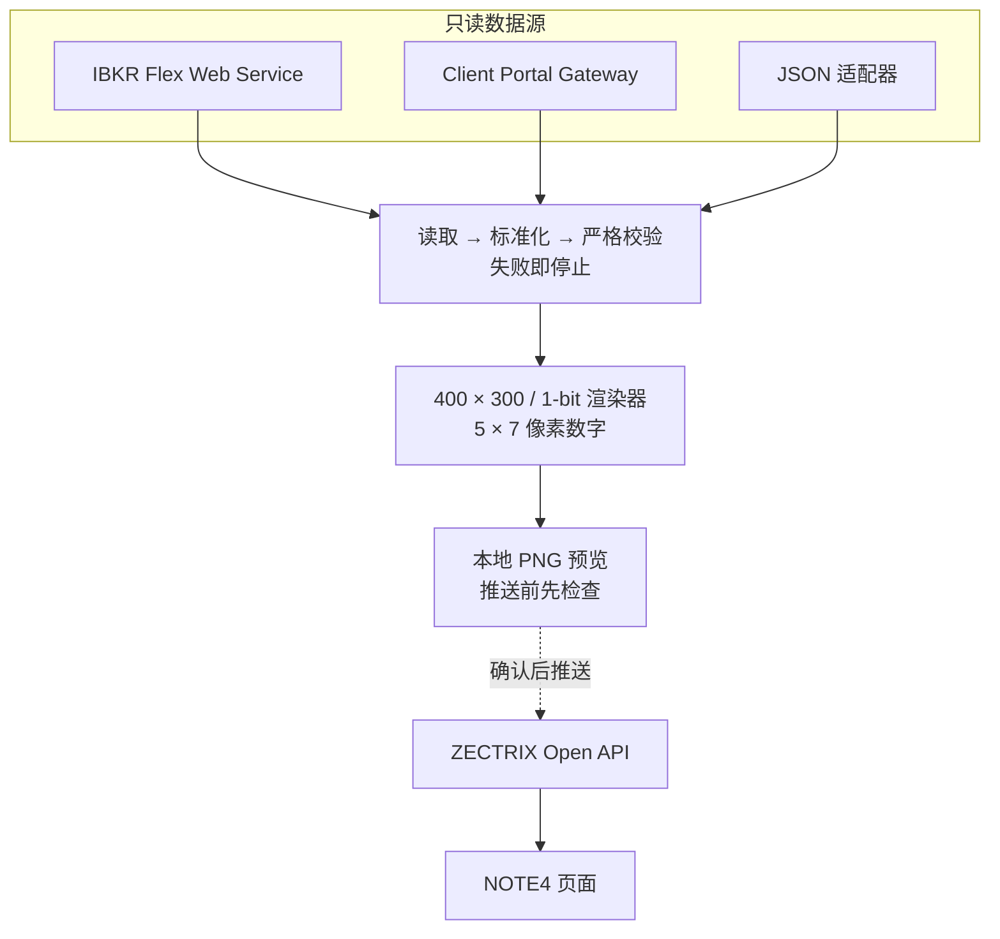

# IBKR NOTE4 Dashboard

<p align="center">
  
</p>

<p align="center">
  <a href="README.md">English</a> · <strong>简体中文</strong>
</p>

一个独立、自托管、只读的 IBKR 投资组合看板：获取账户快照，渲染为确定性的 **400 × 300 黑白 PNG**，在你确认预览后，可选推送到 ZECTRIX NOTE4。

它不依赖 ChatGPT、Codex、LLM 或托管后端，也不会下单、改单或撤单。

> **当前状态：Alpha。** 显示内容仅供参考，请始终以 IBKR 官方数据为准。

## 预览

下图由仓库内置的虚构数据生成，不包含真实账户、持仓或设备信息。小号数字使用 5 × 7 像素字形，以提高 1-bit 墨水屏上的辨识度。

<p align="center">
  
</p>

## 工作原理



运行时只做以下事情：

- 从 Flex、Client Portal 或明确指定的 JSON 来源读取数据；
- 对缺失、过期或含糊的数据“失败即停止”，不会把不可用字段伪装成 `0`；
- 生成 400 × 300、1-bit 黑白图片，最多展示 30 个每日 NAV 点；
- 推送成功后只保存显示数据的 SHA-256 与时间戳，用来跳过未变化画面；
- 可选保存本地 NAV 历史，但不会把原始 Flex 响应、令牌或账户 ID 写入状态文件。

## 选择部署方式

| 你的情况 | 推荐方式 | 配置直达 |
| :---: | :---: | :---: |
| 不配置凭据，先看效果 | 本地 Python | [5 分钟本地预览](#local-python) |
| 有 VPS / NAS，想少踩坑 | Flex + Docker Compose | [Docker Compose 配置](#docker-compose) |
| 熟悉 Linux 服务管理 | Flex + systemd | [systemd 配置](#systemd) |
| 没有服务器 | Flex + GitHub Actions | [GitHub Actions 配置](#github-actions) |
| 需要接近实时的交互使用 | Client Portal Gateway | [Client Portal 配置](#client-portal) |
| 已连接 IBKR，希望美股盘中每半小时刷新 | 可选 ChatGPT/Codex 配套插件（本仓库不包含） | [数据时效与可更新时间](#refresh-windows) |

无人值守时推荐 **IBKR Flex + Docker Compose**。无论选择哪种方式，都按相同的安全顺序执行：本地预览 → 真实数据 no-push 渲染 → 检查图片 → 第一次推送。

<a id="refresh-windows"></a>
## 数据时效与可更新时间

能更新到什么时间的数据，取决于 IBKR 数据源。调度器可以更频繁地启动任务，但不能把报表型的 Flex 数据变成盘中实时数据。

| 数据源或模式 | 数据时效 | 实用调度方式 |
| :--- | :--- | :--- |
| Flex Web Service | 报表数据，通常是 **T-1 / 上一个交易日** | 仓库自带的 systemd timer 默认在工作日 `10:17 UTC` 运行一次，并带最多 5 分钟随机延迟；通常没有必要高频轮询。 |
| Client Portal Gateway | Gateway 会话已认证时可接近实时 | 可以安排盘中刷新，但 IBKR 要求定期在浏览器中重新认证，因此不适合完全无人值守的 VPS。 |
| 可选 ChatGPT/Codex 配套插件 | 从已连接的 IBKR 账户读取当前只读数据 | 可在工作日按纽约时间 `09:30` 到 `16:00` 每 30 分钟运行一次，即常规交易时段每天 14 次；每次运行时本机应用和 IBKR 连接都必须可用。 |

使用 `America/New_York` 时会自动跟随美国夏令时和冬令时：换算为北京时间，夏令时通常是 **21:30–次日 04:00**，冬令时通常是 **22:30–次日 05:00**。这个工作日时间窗本身不会识别美国休市日或提前收盘日。若画面数据没有变化，去重机制可能跳过重复推送。

配套插件是可选方案，与本独立仓库分开；本项目本身仍然不依赖 ChatGPT、Codex 或 LLM。

<a id="local-python"></a>
## 5 分钟本地预览

要求：Python 3.11 或更高版本。

```bash
git clone https://github.com/JessYi228/ibkr-note4-dashboard.git
cd ibkr-note4-dashboard

python3 -m venv .venv
. .venv/bin/activate
python -m pip install -e .

ibkr-note4 preview --output output/preview.png
```

`preview` 只使用内置虚构数据，不访问 IBKR，也不会联系 ZECTRIX。生成后打开 `output/preview.png` 检查尺寸和排版。

如果克隆时 GitHub 要求认证，请先在本机登录；如果源码已经下载，从 `cd ibkr-note4-dashboard` 开始即可。

<a id="live-setup"></a>
## 第一次连接真实数据

### 1. 生成私密配置文件

```bash
ibkr-note4 init
```

这会创建权限为 `0600` 的 `.env`。如果文件已经存在，命令会停止而不是覆盖；只有明确要替换时才使用 `ibkr-note4 init --force`。

### 2. 选择 IBKR 数据源

在 `.env` 中设置 `IBKR_SOURCE`：

| 值 | 适用场景 | 必需配置 |
| :---: | :---: | :---: |
| `flex` | VPS、NAS、容器、定时任务 | `IBKR_FLEX_QUERY_ID`、`IBKR_FLEX_TOKEN` |
| `client_portal` | 交互式、接近实时使用 | 已运行并在浏览器登录的 Client Portal Gateway |
| `json` | 测试或自建只读适配器 | 明确的本地文件或 HTTPS `IBKR_JSON_SOURCE` |

`preview` 是唯一会默认使用样例数据的命令。真实 `run` 永远不会回退到仓库内置样例。

<a id="credentials"></a>
### 3. API 凭据和 ID 从哪里获取

| 配置项 | 获取位置 | 是否属于秘密 |
| :---: | :--- | :---: |
| `IBKR_FLEX_QUERY_ID` | 在 [IBKR Client Portal → Performance & Reports → Flex Queries](https://www.ibkrguides.com/clientportal/performanceandstatements/flex.htm) 创建 Activity Flex Query，保存后可看到 Query ID。 | 不是 token，但应保密 |
| `IBKR_FLEX_DAILY_QUERY_ID` | 在同一位置创建第二个 Activity Flex Query，周期设为 **Last Business Day**。此项可选。 | 不是 token，但应保密 |
| `IBKR_FLEX_TOKEN` | 打开 [Flex Web Service Configuration](https://www.ibkrguides.com/clientportal/performanceandstatements/flex3.htm)，启用服务后点击 **Generate New Token**。生成新 token 会使旧 token 失效。 | **是** |
| Client Portal Gateway | 从 [IBKR 官方安装文档](https://ibkrcampus.com/docs/web-api/authentication/cpgw/installation-authentication) 下载，在本机启动后访问 `https://localhost:5000` 登录。 | 使用交互式 IBKR 登录，不应写入本项目 |
| `IBKR_CP_ACCOUNT_ID` | 可选。留空时程序使用 `/portfolio/accounts` 返回的第一个账户；只有多账户选择时才手动填写。 | 敏感标识 |
| `ZECTRIX_API_KEY` | 登录 [极趣云 API 文档平台](https://cloud.zectrix.com/home/api-docs)，进入 **开放 API**，点击 **创建 API Key**。认证方式与接口见 [ZECTRIX API 文档](https://wiki.zectrix.com/zh/software/api-docs)。 | **是** |
| `ZECTRIX_DEVICE_ID` | 账号只绑定一台设备时可留空；也可运行 `ibkr-note4 devices` 查看脱敏后的设备信息。 | 敏感标识 |
| `HEALTHCHECK_URL` | 可选，由 Healthchecks 兼容服务生成的私密 ping URL。 | **是** |

不要把这些值粘贴到 Issue、提交、截图或聊天中。上面的链接只是官方文档和登录入口，本项目不会替你获取或保存凭据。

<a id="flex"></a>
### 4. 推荐的 Flex Query

创建 XML 格式的 Activity Flex Query，周期使用 **Last 30 Calendar Days**，至少包含：

- **Net Asset Value (NAV) Summary in Base**：Report Date、Cash、Total。
- **Open Positions**：Symbol、Position、Mark Price、Position Value、FIFO PnL Unrealized、FIFO PnL Realized、Currency。
- **Change in NAV**：From Date、To Date、Mark-to-Market、Ending Value。

然后填写：

```text
IBKR_SOURCE=flex
IBKR_FLEX_QUERY_ID=your-main-query-id
IBKR_FLEX_TOKEN=your-flex-token
```

如果需要真实的账户和逐持仓 `DAY P&L`，再创建一个周期为 **Last Business Day** 的 XML 查询，增加 **Mark-to-Market Performance Summary in Base**，并设置：

```text
IBKR_FLEX_DAILY_QUERY_ID=your-daily-query-id
```

没有每日查询时，`DAY P&L` 会显示 `N/A`；程序不会拿累计 FIFO 未实现盈亏冒充当日盈亏。Activity Flex 也不提供 Buying Power，因此 Flex 模式下通常显示 `N/A`。

完整合同见 [docs/flex-query.md](docs/flex-query.md)，字段说明见 IBKR 官方 [Activity Flex Query 字段参考](https://www.ibkrguides.com/reportingreference/reportguide/activity%20flex%20query%20reference.htm)。

<a id="client-portal"></a>
### 5. Client Portal Gateway

只有能够接受浏览器认证和交互式会话时才选择此方式。

1. 按照 [IBKR 官方安装与认证文档](https://ibkrcampus.com/docs/web-api/authentication/cpgw/installation-authentication) 下载并启动 Gateway。
2. 在浏览器访问 `https://localhost:5000` 完成登录。
3. 配置 `.env`：

```text
IBKR_SOURCE=client_portal
IBKR_CP_BASE_URL=https://localhost:5000/v1/api
IBKR_CP_ACCOUNT_ID=
IBKR_CP_VERIFY_TLS=false
```

`IBKR_CP_VERIFY_TLS=false` 只用于本地 Gateway 常见的自签名证书。不要把 Gateway 直接暴露到公网。

<a id="zectrix"></a>
### 6. ZECTRIX 推送配置

按 [极趣云官方 API 说明](https://cloud.zectrix.com/home/api-docs) 创建 API Key，然后设置：

```text
ZECTRIX_API_BASE_URL=https://cloud.zectrix.com
ZECTRIX_API_KEY=your-api-key
ZECTRIX_DEVICE_ID=
ZECTRIX_PAGE_ID=1
```

如果账号只绑定一台设备，`ZECTRIX_DEVICE_ID` 可以留空。用下面的命令验证 API Key 并列出脱敏后的设备：

```bash
ibkr-note4 devices
```

macOS 还可以从以下 Keychain service 读取密钥：

```text
ibkr-zectrix-dashboard/ibkr-flex-token
ibkr-zectrix-dashboard/zectrix-api-key
```

图片推送接口合同见 [docs/zectrix-api.md](docs/zectrix-api.md)。

### 7. 按安全顺序验证

```bash
# 静态配置检查，不打印投资组合数值。
ibkr-note4 doctor

# 实际读取一次，但只报告字段是否可用，不打印数值或股票代码。
ibkr-note4 doctor --probe

# 读取真实数据并渲染，但绝不联系 ZECTRIX。
ibkr-note4 run --no-push

# 检查 output/ibkr-dashboard.png，再确认脱敏后的设备信息。
ibkr-note4 devices

# 只有真实预览确认无误后，才进行第一次推送。
ibkr-note4 run
```

成功推送后，未变化的画面会自动跳过。只有确实需要重发相同画面时才使用 `ibkr-note4 run --force`。

<a id="docker-compose"></a>
## Docker Compose：推荐给 VPS / NAS

先完成 `.env`，然后执行：

```bash
mkdir -p output state

# 仅 Linux：让容器内 uid 10001 可写绑定目录。
sudo chown 10001:10001 output state

docker compose build
docker compose run --rm dashboard ibkr-note4 doctor
docker compose run --rm dashboard ibkr-note4 doctor --probe
docker compose run --rm dashboard ibkr-note4 run --no-push
```

检查 `output/ibkr-dashboard.png` 后，再进行第一次推送：

```bash
docker compose run --rm dashboard
```

容器以只读模式和非 root 用户运行，并移除 Linux capabilities。`output/` 与 `state/` 是唯一持久化写入目录。macOS Docker Desktop 通常不需要执行 `chown`。

Compose 每次调用只刷新一次；周期运行请使用宿主机调度器、systemd timer 或其他编排器。

<a id="systemd"></a>
## systemd：Linux 原生定时

`deploy/systemd/` 下的模板默认假设：

- 项目安装在 `/opt/ibkr-note4-dashboard`；
- 服务用户和组均为 `ibkr-note4`；
- 私密配置位于 `/etc/ibkr-note4-dashboard.env`，权限为 `0600`；
- `output/` 与 `state/` 归服务用户所有。

安装项目并逐项检查这些前提后：

```bash
sudo cp deploy/systemd/ibkr-note4-dashboard.service /etc/systemd/system/
sudo cp deploy/systemd/ibkr-note4-dashboard.timer /etc/systemd/system/
sudo systemctl daemon-reload

# 先手动验证一次，不启用定时器。
sudo systemctl start ibkr-note4-dashboard.service
sudo journalctl -u ibkr-note4-dashboard.service --no-pager

# 预览与日志确认无误后再启用。
sudo systemctl enable --now ibkr-note4-dashboard.timer
systemctl list-timers ibkr-note4-dashboard.timer
```

默认定时器在工作日 `10:17 UTC` 运行，并有最多 5 分钟随机延迟。Flex 通常是 T-1 数据，因此默认不做小时级轮询。

<a id="github-actions"></a>
## GitHub Actions：无服务器方案

把真实刷新自动化放在一个**独立的私人部署仓库**中。这个公开源码仓库只运行不接触凭据的 CI。不会自动执行的起始模板位于 [`deploy/github-actions/refresh.yml.example`](deploy/github-actions/refresh.yml.example)；GitHub 不会执行 `.github/workflows/` 以外的文件。

1. 创建一个独立私人仓库，不要使用 fork；公开仓库的 fork 无法保持私有。
2. 把示例复制为私人仓库中的 `.github/workflows/refresh.yml`。
3. 把所需 Flex 与 ZECTRIX 值加入私人仓库 Actions Secrets。
4. 保留 `no_push=true`，先手动运行一次。
5. 确认日志只报告成功，不包含数值或标识。
6. 再以 `no_push=false` 运行一次完成第一次推送。
7. 只有完成这些验证后，才在私人部署仓库中启用 `schedule`。

模板会检出固定版本的公开源码，不上传投资组合图片，也不把 Actions cache 当数据库；30 天历史直接来自 Flex。GitHub 定时任务可能延迟，长期稳定性通常不如 VPS 或 NAS。

## 常用配置

| 变量 | 用途 | 默认值 |
| :---: | :--- | :---: |
| `IBKR_SOURCE` | `flex`、`client_portal` 或 `json` | `flex` |
| `IBKR_FLEX_QUERY_ID` | 30 天主 Flex Query ID | 无 |
| `IBKR_FLEX_DAILY_QUERY_ID` | 可选 Last Business Day Query ID | 无 |
| `IBKR_FLEX_TOKEN` | Flex Web Service token | 无 |
| `DASHBOARD_TIMEZONE` | 显示和本地历史时区 | `Asia/Shanghai` |
| `DASHBOARD_OUTPUT_PATH` | 渲染图片路径 | `output/ibkr-dashboard.png` |
| `DASHBOARD_STATE_PATH` | 本地 NAV 历史 | `state/history.json` |
| `DASHBOARD_DEDUPE_STATE_PATH` | 推送去重状态 | `state/last-push.json` |
| `DASHBOARD_MAX_POSITIONS` | 最多显示持仓数 | `4` |
| `ZECTRIX_PAGE_ID` | NOTE4 页面 | `1` |
| `ZECTRIX_PUSH_ATTEMPTS` | 临时推送错误重试次数 | `3` |
| `HEALTHCHECK_URL` | 可选私密监控 URL | 无 |

完整模板见 [.env.example](.env.example)。`output/` 和 `state/` 即使不含凭据，也可能包含敏感财务信息，不要提交或公开。

## 常见问题

- **`IBKR_FLEX_QUERY_ID is missing`**：`.env` 默认选择 Flex；完成 [Flex 配置](#flex)，或明确选择其他来源。
- **`IBKR_JSON_SOURCE is missing`**：真实运行必须指定本地文件或 HTTPS URL，不会隐式使用样例。
- **Flex pending / 1019**：报告仍在生成。程序会有限重试，最终未完成时停止且不推送。
- **`DAY P&L` 显示 `N/A`**：配置可选的 [Last Business Day 查询](#flex)。
- **Client Portal 没有返回账户**：在浏览器重新认证 Gateway。
- **Docker 写入失败**：在 Linux 上确认 `output/` 与 `state/` 对 uid `10001` 可写。
- **TLS 错误**：检查系统证书和目标地址，不要为了绕过公网错误而关闭验证。
- **推送成功但屏幕没变化**：API 接受图片只证明云端传输成功，仍需确认设备实际刷新。

## 安全边界

- 永远不要提交 `.env`、token、API key、账户 ID、设备 ID、原始 Flex 响应、真实投资组合图片或状态文件。
- `.gitignore` 只能保护未跟踪文件，不能清理已经进入 Git 历史的秘密。
- Flex 与 ZECTRIX 始终启用 TLS 校验；只有本地 Client Portal 自签名证书可配置。
- 不要公开 Client Portal Gateway 或未认证的 JSON 投资组合接口。
- 凭据一旦出现在提交、日志、截图、Issue 或聊天中，应立即吊销并更换。
- 本项目保持只读，不接受下单功能。

部署前请阅读 [SECURITY.md](SECURITY.md)。

## 项目结构

```text
.
├── src/ibkr_note4/                  # CLI、数据源、校验、渲染、推送
│   └── assets/sample_snapshot.json  # 仅用于预览/测试的虚构样例
├── tests/                            # 合成测试；不做真实推送
├── docs/                             # Flex、ZECTRIX 与 README 资源
├── deploy/systemd/                   # Linux service/timer 模板
├── deploy/github-actions/            # 不自动执行的私人部署 workflow 示例
├── .github/workflows/                # 仅无凭据公开 CI
├── .env.example                      # 不含秘密的完整配置模板
├── Dockerfile
└── compose.yaml
```

## 开发与验证

```bash
python3 -m venv .venv
. .venv/bin/activate
python -m pip install -e .
python -m unittest discover -s tests -v
ibkr-note4 preview --output /tmp/ibkr-note4-preview.png
file /tmp/ibkr-note4-preview.png
```

测试只使用合成 JSON/XML。CI 不连接真实账户，也不会推送设备。修改渲染器时，应附上新的 400 × 300、1-bit 预览，并保留像素数字 `8` 的开放中间行。

## 许可证与免责声明

本项目采用 [MIT License](LICENSE)，与 Interactive Brokers 或 ZECTRIX 无隶属或官方背书关系，也不构成投资建议。

提交问题前请阅读 [CONTRIBUTING.md](CONTRIBUTING.md)。公开 Issue 中不要附上凭据、账户/设备标识、真实持仓或投资组合截图。
